### Books, little ideas & a little C# ✨

Hi, I'm **@Minhthanne16** 👋

📚 I’m interested in reading books · 🌱 I’m currently learning **C#**

## 🐍 A little snake, a year of contributions

One contribution at a time.

<picture>
  <source media="(prefers-color-scheme: dark)" srcset="https://raw.githubusercontent.com/Minhthanne16/Minhthanne16/output/github-snake-dark.svg" />
  <source media="(prefers-color-scheme: light)" srcset="https://raw.githubusercontent.com/Minhthanne16/Minhthanne16/output/github-snake.svg" />
  
</picture>

## 🎧 On my headphones

<!-- SPOTIFY:START -->

  

<!-- SPOTIFY:END -->

✦ **Read a chapter. Write a little code. Repeat.** ✦

